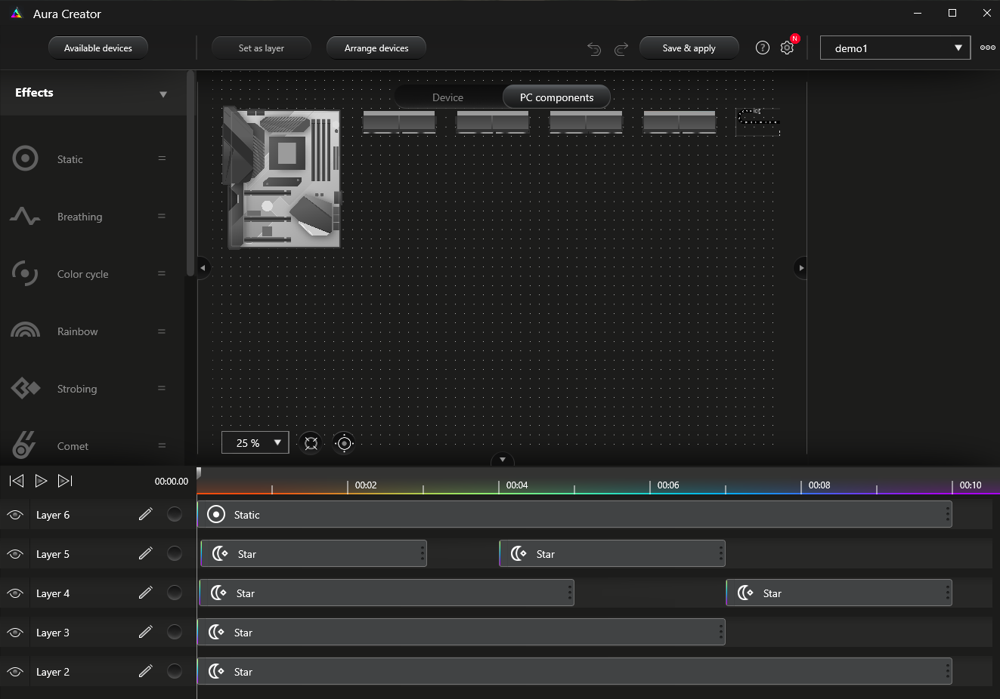

# Overview

This build was a complete refresh from my D-Frame Mini-ITX gaming build. I wanted to move back to an ATX format and the larger tower. With the water cooling success of the D-Frame build, I wanted to try my hand at hard tube bending and (more or less) go all in on lighting.

**A word of caution:** Readers will note the extensive use of ThermalTake (TT) components... I experienced a number of quality issues with the ThermalTake components that created challenges I did not expect to see at the price-points for some of these components (for instance, none of the motherboard holes had threads - I had to tap them all). So, while the end product speaks for itself, I cannot recommend that someone do a full TT build without really thinking it through. A great build can be created but it will likely take some extra work to get there.

[Thermaltake DistroCase 350P Video](media/ThermalTake350P.MOV)

## Hardware Specs

**Note:** Nothing is overclocked at this time.

- [ASUS ROG X570 Crosshair VIII Formula](https://www.amazon.com/gp/product/B07SYGHTCL/ref=ppx_yo_dt_b_search_asin_title?ie=UTF8&psc=1)
- [AMD Ryzen 9 5900x](https://www.amazon.com/AMD-Ryzen-5900X-24-Thread-Processor/dp/B08164VTWH/ref=sr_1_1?crid=21VRXMJYZALEU&dchild=1&keywords=amd+ryzen+9+5900x&qid=1629054774&s=electronics&sprefix=amd+ry%2Celectronics%2C219&sr=1-1)
- 48GB Ram
  - 32GB [G.SKILL TridentZ RGB Series DDR4 PC4-30900](https://www.amazon.com/gp/product/B077Q2ZWHJ/ref=ppx_yo_dt_b_search_asin_title?ie=UTF8&psc=1)
  - 16GB [G.SKILL TridentZ RGB Series DDR4 PC4-34100](https://www.amazon.com/gp/product/B01N4V204L/ref=ppx_yo_dt_b_search_asin_title?ie=UTF8&psc=1) (from a previous build)
- [ASUS EKWB NVidia GeForce RTX-3090 24GB GDDR6X](https://www.asus.com/us/Motherboards-Components/Graphics-Cards/ASUS/RTX3090-24G-EK/)
- [Samsung 980 PRO 1TB PCIe NVMe Gen4 M.2](https://www.amazon.com/gp/product/B08GLX7TNT/ref=ppx_yo_dt_b_search_asin_title?ie=UTF8&psc=1) (x2 running RAID 0)

## Chassis & Power

I'm sure some folks will have some well-founded thoughts about the choice of PSU here... I did read thoroughly on the specs & performance of ThermalTake PSUs versus say Corsair or Antec. My choice here was really based on the continuing to see how well ThermalTake integrated all their components along with the Asus Aura Sync integration. In terms of power, the rig is not going to be anywhere close to 1050 watts so there is plenty of headroom (i.e. the PSU is fine for this specific build out).

- [ThermalTake DistroCase 350P Mid Tower](https://www.thermaltakeusa.com/distrocasetm-350p-mid-tower-chassis.html)
- [ThermalTake PF1 ARGB 1050W](https://www.amazon.com/gp/product/B07WCTCQSK/ref=ppx_yo_dt_b_search_asin_title?ie=UTF8&psc=1)

## Cooling

The main goal here was to learn how to do a hard-tube bending and create a water-cooled rig based on the same (without spraying coolant everywhere). Hence there are some extras here like the tubing bending kit. I used an [Ungar 1095](https://www.amazon.com/185-1095-120-00-Dual-Temperature-Weller/dp/B00OQS41U2/ref=sr_1_5?dchild=1&keywords=heat+gun+weller+1095&qid=1629059985&sr=8-5) (know "Weller" I believe) to bend the tubes.

- [ThermalTake Pacific W5 CPU Water Block](https://www.thermaltakeusa.com/pacific-w5-cpu-water-block.html)
- [ThermalTake Pacific CLD 360 Radiator](https://www.thermaltakeusa.com/pacific-cld-360-radiator.html)
- [ThermalTake V-Tubler PETG Tube 12mm OD 10mm ID 500mm 4 Pack](https://www.thermaltakeusa.com/thermaltake-v-tubler-petg-tube-12mm-od-10mm-id-500mm-4-pack.html) (x3)
- [ThermalTake Pacific G1/4 PETG Tube 12mm OD Compression – Black](https://www.thermaltakeusa.com/pacific-g1-4-petg-tube-12mm-od-compression-black.html) (x8)
- [ThermalTake Pacific 12mm-10mm Hard Tube Bending Kit](https://www.thermaltakeusa.com/pacific-12mm-10mm-hard-tube-bending-kit.html)
- [ThermalTake P1000 Pastel Coolant - White](https://www.thermaltakeusa.com/thermaltake-p1000-pastel-coolant-white.html) (one bottle = one fill up for everything)
- [ThermalTake Riing Trio 12 RGB Radiator Fan TT Premium Edition (3-Fan Pack)](https://www.thermaltakeusa.com/riing-trio-12-rgb-radiator-fan-tt-premium-edition-3-fan-pack.html) (x2 - one set on each side of the radiator)

## Lighting

**RGB:** 0 248 248

Getting the lighting setup was by-far the most challenging part of this build. I ended up *not* using the controller(s) that come with the Riing Trio Fans and instead using ThermalTake's separate [TT Sync Controller TT Premium Edition](https://www.thermaltakeusa.com/tt-sync-controller-tt-premium-edition.html). This proved to be critical in terms of getting the lights to always show the same color scheme even during reboot.

Excluding the motherboard there are a total of 15 lighting devices to control in this build. To control all of this we have 9 inputs on the TT Sync Controller and 2 RGB headers on the motherboard plus direct control from the motherboard (i.e. the RAM).

- Plugged into the TT Sync
  - 2 strips on the DistroCase (top and bottom)
  - CPU water block
  - 6 Riing Trio Fans
- Plugged into the motherboard RGB headers
  - Video Card
  - the TT Sync
- Driven directly from the motherboard
  - 4 sticks of RAM

This left me with the PSU *not* hooked up to anything. Fortunately, the ThermalTake PSU allows us to select a number of colors and an animation. The blue option was close enough to work with what I already had and I set the animation to spin around the PSU fan.

To create the animations for the RAM I used Asus AuraCreator and selected it in Asus' ArmoryCrate. This can be seen in the image below. The motherboard and DistroCase are in Layer 6 and I created a separate Layer for each stick of RAM. I then applied the Star animation somewhat randomly to each stick in each layer. The whole thing loops every 10s.

